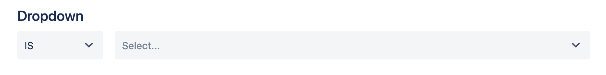
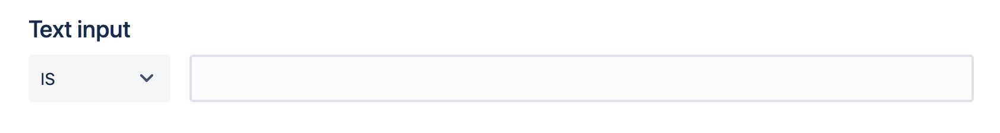
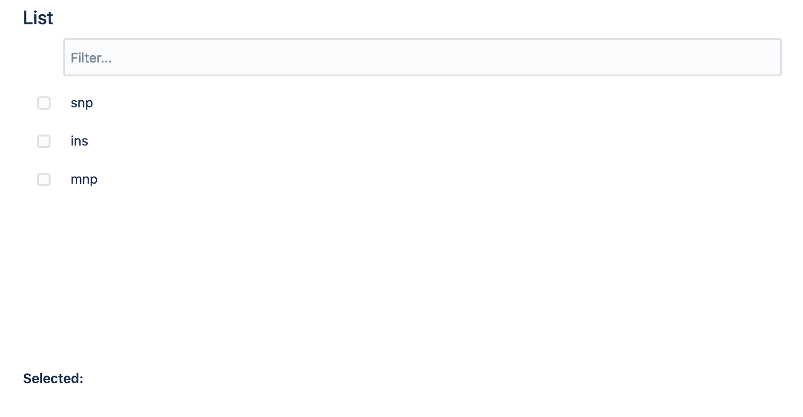
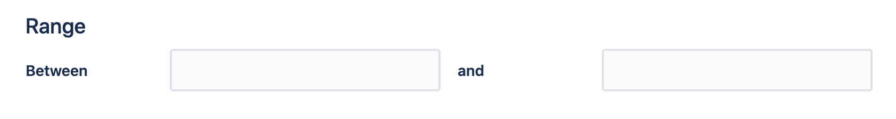
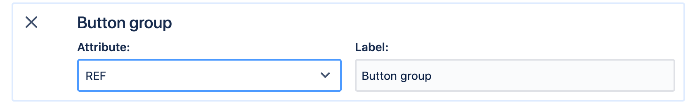

# Project overview

This project contains the `frontend/` discovery React app, which talks to the `backend/` REST API, currently written in Python, using the FastAPI framework. 


## Dev mode
The whole project can be built and deployed in dev mode using docker compose, by running

```bash
docker-compose up -d
```

See `docker-compose.yml` for details of what containers are deployed. Briefly, we have:

-   `web` which is the Python web server, hosting the REST API
-   `db`, a Postgres database
-   `dev` the development server for the react frontend


## Heroku demo

There is a demo site deployed on a Heroku server at https://cv-new.herokuapp.com/. This build uses the `Dockerfile` in the root of this repository, which compiles the react app and uses nginx to server up the React app and a reverse proxy to a uvicorn server, which serves the api from the same domain.

To push changes to Heroku, we use

```bash
git push heroku master
```

For detail on deploying to Heroku, see https://devcenter.heroku.com/articles/git

## Deployment details

There are a few params which need to be set, when deploying the front/backend:

### Frontend

-   If the front end is being hosted in a subdirectory on the web server, e.g. at https://cv-new.herokuapp.com/discovery, we need to make sure that the parameter `homepage` is set accordingly in `frontend/package.json`:

    ```json
    ...
    "homepage": "/discovery/",
    ...
    ```

-   If the API is hosted on a different server or under a different subdirectory (i.e. not `/api`), we need to modify the `REACT_APP_API_URL` variable in `frontend/.env.production` accordingly.

### Backend

If using the Python server as backend, ensure that the live environment contains a valid `DATABASE_URL` variable. If unset, the default connection string will be the dev one, defined in `docker-compose.yml`:

```bash
postgresql://hello_fastapi:hello_fastapi@db/hello_fastapi_dev
```


# Backend architecture

The backend is a very simple REST server written in Python, using FastAPI. The reason this framework was chose was because its apparently fast and supports OpenAPI "standards". This means that one can declare models of requests and responses (`backend/api/models.py`). The main use case is the definition of a `Query`:

```python
class BoolOp(str, Enum):
    andOp = 'and'
    orOp = 'or'

class Quantifier(str, Enum):
    exists = 'exists'

class BaseBoolOp(str, Enum):
    isOp = 'is'
    isLikeOp = 'is like'
    isNotOp = 'is not'
    isNotLikeOp = 'is not like'
    ltOp = '<'
    ltEqOp = '<='
    gtOp = '>'
    gtEqOp = '>='

class BaseQuery(BaseModel):
    attribute: Union[dict, str]
    operator: BaseBoolOp
    value: str

class GroupQuery(BaseModel):
    children: List[Union[BaseQuery, 'GroupQuery']]
    operator: Union[BoolOp, Quantifier]
    from_: Optional[dict]

    class Config:
        fields = {
        'from_': 'from'
        }

GroupQuery.update_forward_refs()

class Query(BaseModel):
    query: Union[BaseQuery, GroupQuery]
```

This corresponds to a pseudo BNF/JSON grammar, where `?json` means the field is an optional json value, `BaseQuery | GroupQuery` means either `BaseQuery` or `GroupQuery` and `[BaseQuery | GroupQuery]` is a list of either:


```
Query ::= BaseQuery | GroupQuery

BaseQuery ::= {
    attribute: json
    operator: BaseBoolOp
    value: string
}

GroupQuery ::= {
    operator: (BoolOp | Quantifier) 
    from: ?json
    children: [BaseQuery | GroupQuery]
}

BaseBoolOp ::= 'is' | 'is like' | 'is not' | 'is not like' | '<' | '<=' | '>' | '>='

BoolOp ::= 'and' | 'or'

Quantifier ::= 'exists'
```

## Data Model


### Simple queries

The way we store data in the Postgres is structure agnostic. This means we can store any valid json file in the database and query its parameters. For example, if we store the following patient record:

```json
{
    "id": 1,
    "name": "Jane Doe",
    "age": 30,
    "gender": "female",
}
```

we can query the database for a record where `age` is greater than 25, by running the following Postgres query:

```sql
select * from eavs where (data ->> 'age')::integer > 25
```

To execute this query via the REST API, we would do a POST request to the `/api/query` endpoint, sending the following payload:

```json
{
    "query": {
        "attribute": {"age": "int"},
        "operator": ">",
        "value": "25"
    }
}
```

The React frontend generates this kind of JSON object for every query. 

### Compound queries

For complex queries, like `age` > 25 and `gender` female, where the SQL query would be:

```sql
select * from eavs where (data ->> 'age')::integer > 25 and data ->> 'gender' = 'female'
```

We use the `GroupQuery` schema:

```json
{
    "query": {
        "operator": "and",
        "children": [
            {
                "attribute": {"age": "int"},
                "operator": ">",
                "value": "25"
            },
            {
                "attribute": {"gender": "str"},
                "operator": "is",
                "value": "female"
            }
        ]
    }
}
```

We can store and query JSON documents with arbitrary structure and nesting, for example, if we extend our patient record:

```json
{
    "id": 1,
    "name": "Jane Doe",
    "age": 30,
    "gender": "female",
    "stats": {
        "height": 186,
        "blood_group": "AB"
    }
}
```

To query the database for a record with the `blood_group` AB, we would run the following SQL query:

```sql
select * from eavs where data -> 'stats' ->> 'blood_group' = 'AB'
```

The corresponding API query is:

```json
{
    "query": {
        "attribute": {"stats": {"blood_group": "str"}},
        "operator": "is",
        "value": "AB"
    }
}
```


### Queries over arrays

So far, we can query arbitrary nesting of JSON dicts. However, we also want to be able to extend our record to have an array/list of attributes, such as:

```json
{
    "id": 1,
    "name": "Jane Doe",
    "age": 30,
    "gender": "female",
    "stats": {
        "height": 186,
        "blood_group": "AB"
    },
    "hospital_visits": ["2020-04-08T00:00:00.000Z", "2020-01-26T00:00:00.000Z"]
}
```

When querying the parameter `hospital_visits` the most likely query we want to ask is, does there exists an element in the list of `hospital_visits` such that `...`. For example, this is the query for finding the number of patients that visited the hospital after January 1st, 2020:


```sql
select count(*) from eavs where 
    exists (select * from jsonb_array_elements(data -> 'hospital_visits') as x where 
        (x::text)::timestamp > '2020-01-01T00:00:00.000Z')
```

However, this query is quite inefficient when querying a large dataset. We would instead run the following equivalent query:

```sql
select count(distinct(subject_id)) from eavs, jsonb_array_elements(data -> 'hospital_visits') as x where (x::text)::timestamp > '2020-01-01T00:00:00.000Z'
```

To run the same query via the REST API, we use the `exists` operator (**TODO queries over timestamp are not actually implemened yet!!**):

```json
{
    "query": {
        "operator": "exists",
        "from": {"hospital_visits": "array"},
        "children": [
            {
                "attribute": "timestamp",
                "operator": ">",
                "value": "2020-01-01T00:00:00.000Z"
            }
        ]
    }
}
```

We can of course also have complex objects inside the array:


```json
{
    "id": 1,
    "name": "Jane Doe",
    "age": 30,
    "gender": "female",
    "stats": {
        "height": 186,
        "blood_group": "AB"
    },
    "hospital_visits": [
    	{"date": "2020-04-08T00:00:00.000Z", "doctor_id": 20}, 
    	{"date": "2020-01-26T00:00:00.000Z", "doctor_id": 127}
    ]
}
```

The SQL query for the number of patients seen by `doctor_id` 127 would then be:

```sql 
select count(distinct(subject_id)) from eavs, jsonb_array_elements(data -> 'hospital_visits') as x where (x ->> 'doctor_id')::integer = 127
```

The corresponding API query is:

```json
{
    "query": {
        "operator": "exists",
        "from": {"hospital_visits": "array"},
        "children": [
            {
                "attribute": {"doctor_id" : "int"},
                "operator": "is",
                "value": "127"
            }
        ]
    }
}
```


# Frontend architecture

The frontend is built using React and can be found in `frontend/src`. There are two main pages/views, the `/:id` and `/settings/:id`. They are defined in `frontend/src/modules/MainRouter.js`, where:

-	`/:id` is routed to `frontend/src/pages/DiscoveryPage.js`
-	`/settings/:id` is routed to `frontend/src/pages/SettingsPage.js`

## Discovery page

The discovery page is dynamically loaded by calling the `/api/loadSettings` endpoint, whcih returns a JSON object, encoding the view. This view is made up of components, found in `frontend/src/componets/`. The components are shown below, along with the kind of queries they generate:






##### Query:

```json
{
    "attribute": <attribute>,
    "operator": "is",
    "value": <value>
}
```

```json
{
    "operator": "exists",
    "from": <attribute1>,
    "children": [
        {
            "attribute": <attribute2>,
            "operator": "is",
            "value": <value>
        }
    ]
}
```

---



##### Query:

```json
{
    "operator": "and",
    "children": [
        {
            "attribute": <attribute>,
            "operator": "is",
            "value": <value1>
        }, 
        {
            "attribute": <attribute>,
            "operator": "is",
            "value": <value2>
        }
    ]
}
```

---




##### Query:

```json
{
    "operator": "and",
    "children": [
        {
            "attribute": <attribute>,
            "operator": ">=",
            "value": <value1>
        }, 
        {
            "attribute": <attribute>,
            "operator": "<=",
            "value": <value2>
        }
    ]
}
```


## Settings page


In the examples above, the `<attribute>` can be set in the settings page. Each of the components above has a settings box, where this, and other parameters can be set. For example, if we set the box attribute to `REF` in the example below:




then selecting the value `T`:


generates:

~~~json
{
	"attribute": {"REF": "str"},
	"operator": "is",
	"value": "T"
}
~~~

## Components

The components shown above are just React components, which follow certain conventions. 

Given a new component called `MyComponent`:

-	The component must be placed inside `frontend/src/components`, following the naming convention of `MyComponentBuilder.js`
-	The components setting class should be placed inside `frontend/src/components/settings`, following the naming convention of `MyComponentBuilderSettings.js`
-	Components must be imported in `frontend/src/components/typesWOQueryTree.js` and the `typeMap` extended with:

	~~~js
	'MyComponentBuilder': { 
    	type: MyComponentBuilder, 
    	settings_type: MyComponentBuilderSettings,
    	label: 'Label for my component'
    },
    ~~~

- 	`MyComponentBuilder.js` has to call `this.props.setQuery` to pass back a subquery generated within the component back to the parent. There is a convenience method `mkAttrQuery` in `frontend/src/utils/utils.js`, where `mkAttrQuery(attribute, (v)=>v, 'is', value)` generates:

	```json
	{
        "attribute": <attribute>,
        "operator": "is",
        "value": <value>
    }
	```

